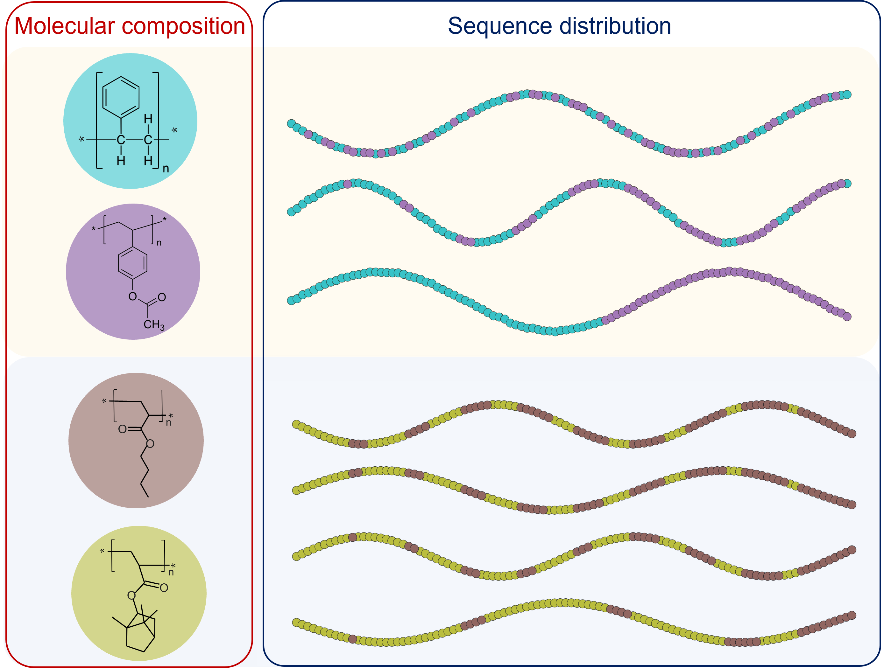

# Copolymer Machine Learning
Code and data for the paper [Machine learning strategies for the structure-property relationship of copolymers](https://www.cell.com/iscience/fulltext/S2589-0042(22)00857-4).

A machine-learning (ML) implementation that incorporate the information of both **molecular composition** and **sequence distribution** of copolymers including **random, block, and gradient** copolymers. Please refer to our work "Machine Learning Strategies for the Structure-Property Relationship of Copolymers" for additional details.

## General Use
training script: test_baseline.ipynb

pip requirements: requirements.txt

tested on Unity. 
